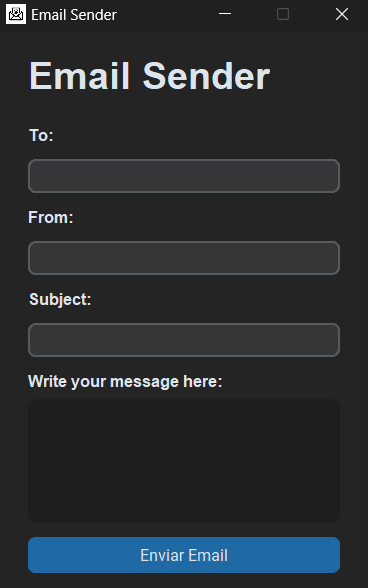

# Email Sender

### About 📙
This app was develompted with goal of automatizate some email messages(google email -> gmail), using smtp protocol with TLS(Transport Layer Security) and threading python library.

**Project Preview**


### Tools 🛠️
- Python
- Libraries:
    - smtp
    - python-decouple
    - customtkinter
    - tkinter
    - threading
    - os

### How to run?
```bash
    # In your git bash, clone the repo.
    git clone https://github.com/angelo-francisco/EmailSender.git

    # Activate the enviroment
    # att.: can be different on another OS
    ./venv/Scripts/Activate.ps1

    # run the project
    python ./src/main.py
```
### License 🔑

The license of the project is [MIT](https://opensource.org/license/mit)